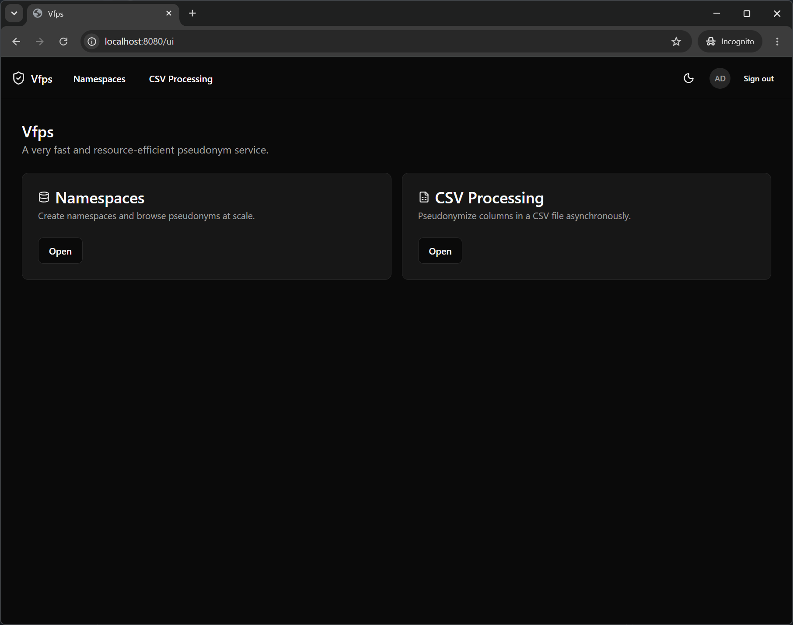
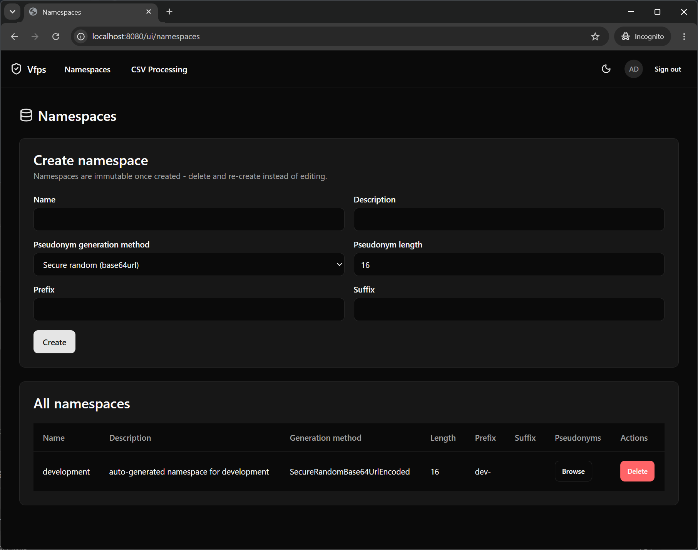
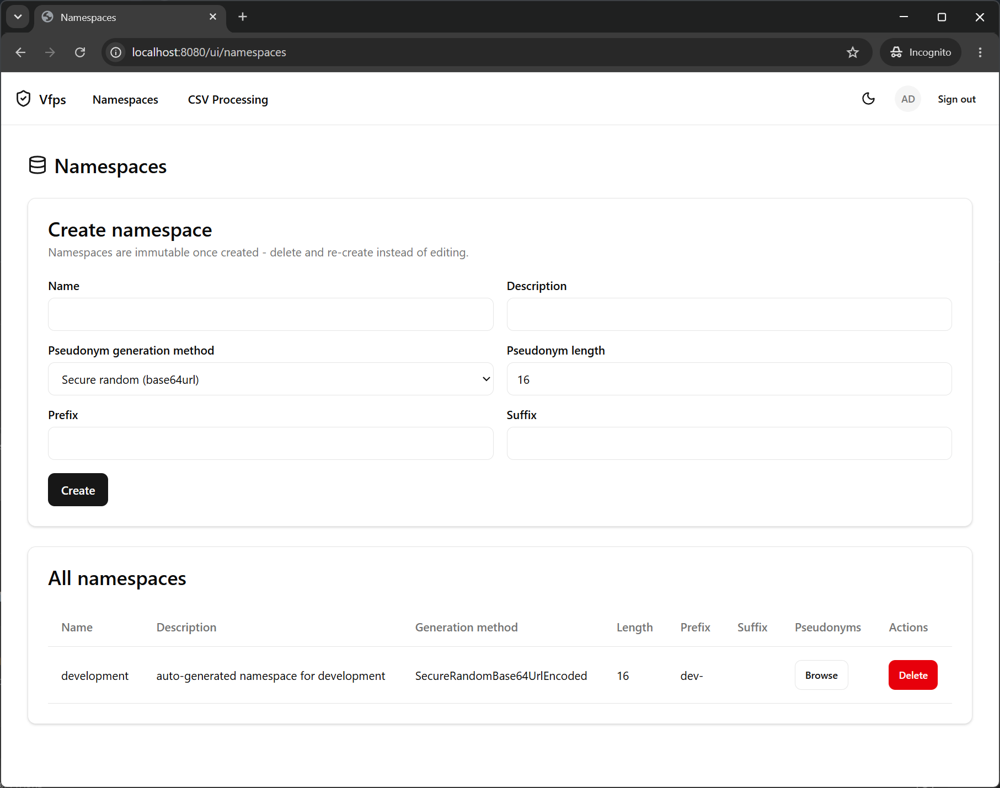
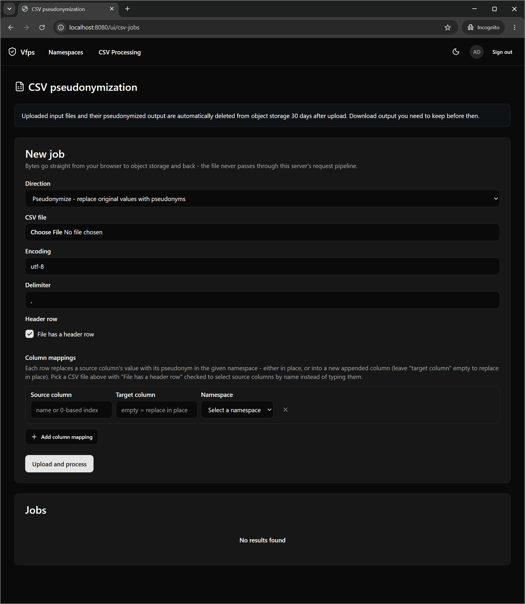

# vfps


[](https://api.securityscorecards.dev/projects/github.com/miracum/vfps)
[](https://slsa.dev)

A [very fast](#e2e-load-testing) and [resource-efficient](#resource-efficiency) pseudonym service.

Supports horizontal service replication for highly-available deployments.

## Run it

> **Warning**
> Using the provided docker-compose.yaml is not a production-ready deployment but merely
> used to get started and testing quickly.
> It sets very restrictive resource limits uses the default password for an included,
> unoptimized PostgreSQL deployment.

```sh
docker compose -f compose.yaml --profile=test up
```

Visit <http://localhost:8080/> to view the OpenAPI specification of the Vfps API:

You can use the JSON-transcoded REST API described via OpenAPI or interact with the service using gRPC.
For example, using [grpcurl](https://github.com/fullstorydev/grpcurl) to create a new namespace:

```sh
grpcurl \
  -plaintext \
  -import-path src/Vfps/ \
  -proto src/Vfps/Protos/vfps/api/v1/namespaces.proto \
  -d '{"name": "test", "pseudonymGenerationMethod": "PSEUDONYM_GENERATION_METHOD_SECURE_RANDOM_BASE64URL_ENCODED", "pseudonymLength": 32}' \
  127.0.0.1:8081 \
  vfps.api.v1.NamespaceService/Create
```

And to create a new pseudonym inside this namespace:

```sh
grpcurl \
  -plaintext \
  -import-path src/Vfps/ \
  -proto src/Vfps/Protos/vfps/api/v1/pseudonyms.proto \
  -d '{"namespace": "test", "originalValue": "to be pseudonymized"}' \
  127.0.0.1:8081 \
  vfps.api.v1.PseudonymService/Create
```

### Multiple pseudonyms per original value

A namespace created with `"allowsMultiplePseudonyms": true` lets a single `Create` call store more
than one distinct pseudonym for the same original value, via the request's optional `count` field
(omitted or `1` preserves the default single-pseudonym behavior for every other namespace):

```sh
grpcurl \
  -plaintext \
  -import-path src/Vfps/ \
  -proto src/Vfps/Protos/vfps/api/v1/namespaces.proto \
  -d '{"name": "multi-psn-example", "pseudonymGenerationMethod": "PSEUDONYM_GENERATION_METHOD_FULL_RANDOM_HEX_ENCODED", "pseudonymLength": 32, "allowsMultiplePseudonyms": true}' \
  127.0.0.1:8081 \
  vfps.api.v1.NamespaceService/Create

grpcurl \
  -plaintext \
  -import-path src/Vfps/ \
  -proto src/Vfps/Protos/vfps/api/v1/pseudonyms.proto \
  -d '{"namespace": "multi-psn-example", "originalValue": "to be pseudonymized", "count": 3}' \
  127.0.0.1:8081 \
  vfps.api.v1.PseudonymService/Create
```

The response's `pseudonyms` array holds the full set (`pseudonym` is kept, populated with the
first one, for callers that only read a single value). The stored set for a given original value
only ever grows: calling `Create` again with a `count` at or below what's already stored returns
the existing set unchanged, while a larger `count` adds exactly the missing pseudonyms. CSV
pseudonymization jobs and the FHIR `$create-pseudonym` operation don't support requesting more
than one pseudonym - both always operate on the first (`sequenceNumber: 0`) pseudonym for a
multi-psn namespace.

> **Note**
> The `PSEUDONYM_GENERATION_METHOD_SHA256_HEX_ENCODED` generation method has been removed -
> it was the only deterministic method, and determinism is incompatible with generating multiple
> distinct pseudonyms for the same original value. Namespaces can no longer be created with it;
> this is a breaking change for anything scripting namespace creation against that enum value.

### Multi-level namespaces

Namespaces can form a hierarchy: a namespace created with a `parentName` is a *child* namespace,
whose original values are pseudonym values produced by its parent. This is how multiple levels of
pseudonymization are built - e.g. an MPI is pseudonymized in a root namespace, and that pseudonym
is then re-pseudonymized in a per-study child namespace, so a study never sees a value that
resolves directly to the MPI.

Each namespace keeps its own generation configuration; nothing is inherited from the parent.
Setting `parentValidationMode` to `PARENT_VALIDATION_MODE_ENSURE_EXISTS` additionally requires
every original value to already exist as a pseudonym in the parent namespace, rejecting anything
else with a `FAILED_PRECONDITION` error:

```sh
grpcurl \
  -plaintext \
  -import-path src/Vfps/ \
  -proto src/Vfps/Protos/vfps/api/v1/namespaces.proto \
  -d '{"name": "study-a", "pseudonymGenerationMethod": "PSEUDONYM_GENERATION_METHOD_FULL_RANDOM_HEX_ENCODED", "pseudonymLength": 32, "parentName": "test", "parentValidationMode": "PARENT_VALIDATION_MODE_ENSURE_EXISTS"}' \
  127.0.0.1:8081 \
  vfps.api.v1.NamespaceService/Create
```

Chaining a pseudonym into the child namespace is an ordinary `Create` call whose `originalValue`
is the parent's pseudonym value. A namespace's direct children can be listed with `ListChildren`
(`GET /v1/namespaces/{name}/children`), which is deliberately non-recursive - call it once per
level to walk a whole tree.

The parent link is set at creation and can't be changed afterwards, like every other namespace
field, which also makes hierarchy cycles impossible. A namespace that still has children can't be
deleted; delete the children first. Deleting a pseudonym level doesn't cascade to any other level.

## Admin UI

vfps ships with a web-based admin UI, served at `/ui`, for creating and browsing namespaces and running CSV pseudonymization jobs.



### Namespaces

Create namespaces and browse or delete existing ones.

<p>
  
  
</p>

A namespace can carry an **original value validation regex**: a pattern every original value must
match before a pseudonym is generated for it. Since namespaces are immutable, getting that pattern
wrong means deleting and re-creating the namespace, so the create form checks it as it is typed -
it reports whether the pattern compiles (with the regex parser's own explanation of what is wrong
when it doesn't), and lets you try a value against it to see whether it would be accepted or
rejected. Both run the exact check the server performs on every pseudonym create, including its
timeout, so a pattern that is valid but catastrophically slow is flagged too.

### Access Control

Roles and individual users are granted read, write and reverse-lookup access per namespace. Only
admins (`Authorization__AdminRoles`) can see any of this, and only while `Authorization__IsEnabled`
is `true` - with authorization off, every request already has full access to everything.

Grants are made on the **Namespaces** page: select a namespace in the hierarchy and use _Configure
access_. The **Access Control** page is a read-only overview - the admin roles, and who effectively
holds which permission on each namespace.

A grant names one **scope** (a single namespace, or _All namespaces_ - which also covers namespaces
created later) and one **grantee**:

- a **role**, matched against the caller's `Authorization__RoleClaimType` claims exactly as the
  identity provider emits them; or
- an **email address**, matched against the caller's `email` claim, granting that one person access
  regardless of which roles they hold. **Only a verified address matches**: the caller's token must
  also carry `email_verified: true`, since an unconfirmed address is a self-asserted string and a
  realm allowing self-registration or an unverified address change would otherwise let anyone claim
  someone else's grants. An identity provider that issues no `email_verified` claim at all
  therefore never matches an email grant - use role grants there.

Grants are additive and there are no deny rules - a caller gets the union of everything granted to
any of their roles and to their email address, and the absence of a grant is the denial.
Reverse-lookup (revealing a pseudonym's original value) is a separate, more tightly-scoped
permission than read: read access alone never reveals original values. Grants are **not** inherited
down a [namespace hierarchy](#multi-level-namespaces) - like the generation settings a namespace
carries, access is set per namespace.

Toggling a permission saves it immediately. It takes effect at once on the replica handling the
request; other replicas pick it up within `Authorization__GrantCacheDuration` (30s by default).

Grants scoped to _All namespaces_ can no longer be created or changed through the UI, since the
per-namespace dialog only edits grants belonging to the namespace it was opened for. Existing ones
keep working, and are listed for context wherever they apply.

#### Migrating from `Authorization__NamespaceRules`

The static `Authorization__NamespaceRules` section is gone and is **not** imported automatically -
an upgrade leaves every non-admin without access until an admin re-creates the equivalent grants
with _Configure access_ on the Namespaces page. Each old rule maps directly: the rule's `Namespace`
becomes the namespace whose access is being configured, and each role in `ReadRoles`/`WriteRoles`/
`ReverseLookupRoles` becomes a role grant with the matching permission switched on. A rule scoped
to `"*"` has no UI equivalent any more and has to be re-created per namespace. Remove the
`Authorization__NamespaceRules__*` variables from your deployment; they are now ignored.

### CSV Processing

Upload a CSV file to pseudonymize or de-pseudonymize one or more columns as a background job. Files are streamed directly to and from S3-compatible object storage.



The same page also moves a whole namespace in and out as CSV, as two further job directions:

- **Import** loads already-known pairs into one namespace instead of generating pseudonyms for
  them - for migrating a mapping table that predates vfps, or moving a namespace between
  instances. The file needs an `original` and a `pseudonym` column (either name can be changed on
  the form, or given as a 0-based column index for a file without a header row); any other column
  is ignored. Requires **write** access to the namespace.

  Nothing is ever overwritten: an original value that already has a pseudonym keeps it, and a
  pseudonym already in use for a different original value is refused rather than left ambiguous to
  reverse-lookup. Every row - accepted or not - comes back in the job's downloadable report as the
  input row plus a `status` column (`Imported`, `AlreadyPresent`, `OriginalValueConflict`,
  `PseudonymValueConflict`, `InvalidOriginalValue`, `ParentValueMissing`, or `MissingValue` for a
  blank/placeholder cell), so re-running the same file is a clean no-op and a partial import is
  inspectable row by row. A namespace that allows multiple pseudonyms per original value grows
  instead of conflicting, exactly as its generating create path does.

- **Export** writes every original value in a namespace and its pseudonym to a two-column CSV,
  ready to be imported elsewhere. It is the one direction with no file to upload - the job is
  queued as soon as it is created. Requires **reverse-lookup** access: the output is the
  namespace's original values, in bulk, so it is gated like de-pseudonymization rather than like a
  read.

## Production-grade deployment

See [charts/vfps](charts/vfps) for a production-grade deployment on Kubernetes via Helm.

### Running more than one replica

vfps keeps no durable state of its own outside PostgreSQL, so replicas are interchangeable and can
be scaled horizontally. A few things are the deployment's responsibility rather than the
application's, and are easy to miss:

- **The admin UI needs session affinity.** The UI is Blazor Server: each browser session is a
  SignalR circuit living in one replica's memory. Without sticky sessions the initial page request
  and the circuit's WebSocket can land on different replicas, and a circuit can't be resumed on a
  different replica than the one that created it - which shows up in the browser console as
  `Failed to start the connection` / `No Connection with that ID: Status code '404'`. Configure
  cookie affinity in your ingress controller or, failing that, `sessionAffinity: ClientIP` on the
  Service. Check which object the controller reads its annotations from: Traefik's
  `traefik.ingress.kubernetes.io/service.sticky.cookie*` annotations belong on the **Service** and
  are ignored on the Ingress, while ingress-nginx's `nginx.ingress.kubernetes.io/affinity*` go on
  the Ingress. The gRPC and REST APIs are stateless and need none of this - and because the UI and
  the REST API share port 8080, affinity applied to a Service carrying both will pin REST clients
  that keep a cookie jar too. The chart's `service.ui.enabled` creates a separate UI Service to
  hold the affinity, leaving API traffic evenly balanced. Auth cookies and antiforgery tokens *are* portable across
  replicas - the Data Protection key ring is persisted to PostgreSQL whenever
  `ConnectionStrings__PostgreSQL` is set (see the table above) - so affinity is about the circuit,
  not about login.
- **gRPC clients pin to a single replica.** A gRPC client opens one long-lived HTTP/2 connection,
  and a plain ClusterIP Service load-balances connections, not requests - so one client's traffic
  stays on whichever replica it first connected to. For traffic to actually spread, point clients at
  the chart's headless Service with client-side load balancing (`dns:///` plus a `round_robin`
  policy), or terminate gRPC at a proxy that balances per request.
- **Size the connection pool for the replica count, not the replica.** Npgsql's pool is per process
  and defaults to 100 connections, so N replicas can demand N x 100 against a PostgreSQL whose own
  `max_connections` commonly defaults to 100. Set `Maximum Pool Size` explicitly in the connection
  string, budget for `CsvProcessing__WorkerCount` on top of request traffic, and put PgBouncer in
  front if the arithmetic doesn't fit.
- **Caches are per-replica.** `Pseudonymization__Caching__*` is an in-process `MemoryCache`, so a
  namespace deleted via one replica can still be served from another replica's cache until the
  entry expires (`Pseudonymization__Caching__AbsoluteExpiration`, one hour by default). Namespaces
  are immutable once created, so this only affects deletion; shorten the expiration if that window
  matters to you.
- **Give the pod time to drain.** On `SIGTERM` the process stops accepting new work and finishes
  what's in flight, bounded by `ShutdownTimeout`. Kubernetes removes the pod from Service endpoints
  asynchronously, so without a `preStop` delay some requests are still routed to a pod that has
  already begun shutting down. Add a `preStop` sleep of a few seconds and keep
  `terminationGracePeriodSeconds` > `ShutdownTimeout` > `CsvProcessing__JobServerShutdownTimeout`.
  Note the runtime image is chiseled and has no shell, so a `preStop` `exec` handler won't work -
  use the native `sleep` handler (Kubernetes 1.30+).
- **Run migrations once, not per replica.** Leave `ForceRunDatabaseMigrations` off and run the
  `Vfps.dll migrate` subcommand as a separate Job. Because that Job runs while
  the previous version's pods are still serving, migrations have to be backwards-compatible with the
  running version (expand/contract) for the upgrade to be non-disruptive.
- **CSV jobs can run in dedicated worker pods.** By default every replica processes jobs, which is
  fine until job load starts competing with API latency, or until you want jobs to drain slowly on
  shutdown while API pods roll quickly - a single deployment can only have one shutdown window and
  one resource budget. Setting `CsvProcessing__ProcessJobs=false` on the API pods and running a
  second deployment of the same image with it set to `true` separates the two. The Helm chart wires
  this up via `worker.enabled`.
- **The per-namespace pseudonym count metric is computed by one replica and shared.**
  `vfps_pseudonyms` comes from a `GROUP BY` count over the whole pseudonyms table, so it's
  recomputed every 5 minutes by a Hangfire recurring job - dispatched to a single server per tick,
  which is what keeps one replica paying for it - and written to the `pseudonym_counts` table, one
  row per namespace. Every replica reads that table on a short timer and exports the stored result,
  so all of them report the same figure: graph it with `max()` or `avg()` across replicas rather
  than `sum()`. A failed recompute is visible on the `/hangfire` dashboard and leaves the previous
  counts in place until the next tick succeeds.

### Encrypting the connection to PostgreSQL

Nothing here sets `SSL Mode` by default, which leaves Npgsql's own default in place: it encrypts
opportunistically, verifies nothing, and **silently falls back to plaintext** against a server
that offers no TLS. A misconfigured server downgrades the connection with no error and no log
line, so this is worth setting explicitly rather than assuming.

The Helm chart configures it through `database.tls`, which applies to every component that opens a
database connection - the API Deployment, the worker Deployment, and the migrations Job:

```yaml
database:
  tls:
    mode: VerifyFull
    certificateAuthority:
      existingSecret:
        name: "vfps-db-ca"
        key: "ca.crt"
```

`VerifyFull` verifies the server's certificate chain *and* that its name matches the host being
connected to. `VerifyCA` verifies only the chain; every other mode verifies nothing. The CA secret
can be omitted when the server's certificate is signed by a CA already in the container's trust
store - typical for a managed cloud database, never the case for a cluster-internal one. Setting
`SSL Mode` in `database.additionalConnectionStringParameters` as well is rejected at template
time, so the connection string and the mounted certificates cannot drift apart.

#### CloudNativePG

A [CloudNativePG](https://cloudnative-pg.io/) `Cluster` serves TLS out of the box and issues its
own CA, so there is nothing to enable on the database side - only a trust anchor to hand over.
The operator creates these Secrets per cluster:

| Secret             | Contents                                                | Used for                                        |
| ------------------ | ------------------------------------------------------- | ----------------------------------------------- |
| `<cluster>-ca`     | `ca.crt`, `ca.key`                                      | `database.tls.certificateAuthority`             |
| `<cluster>-server` | `tls.crt`, `tls.key`                                    | the server's own identity; vfps never reads it  |
| `<cluster>-app`    | `username`, `password`, `dbname`, `host`, `port`, `uri` | `database.username` / `database.existingSecret` |

```yaml
database:
  host: "vfps-db-rw"          # the cluster's read-write Service
  port: 5432
  database: "app"
  username: "app"             # must match the -app Secret's `username`
  existingSecret: "vfps-db-app"
  existingSecretKey: "password"
  tls:
    mode: VerifyFull
    certificateAuthority:
      existingSecret:
        name: "vfps-db-ca"
```

The chart projects `ca.crt` out of that Secret key by key rather than mounting it whole. This is
deliberate: `<cluster>-ca` also contains `ca.key`, the key that signs every certificate in the
cluster, and mounting the Secret wholesale would hand the vfps pod the ability to mint credentials
for its own database.

**Check the certificate's SAN before rolling out.** `VerifyFull` matches the host you connect to
against the server certificate's Subject Alternative Names, and a mismatch fails the handshake
while the chain itself verifies perfectly - a confusing failure if you are not expecting it:

```sh
kubectl get secret vfps-db-server -o jsonpath='{.data.tls\.crt}' | base64 -d \
  | openssl x509 -noout -ext subjectAltName
```

Set `database.host` to a name that actually appears there. If the form your DNS resolves is not
listed, either use one that is, or drop to `VerifyCA` - which still verifies the chain, and inside
a cluster whose DNS you trust is a defensible trade, though it does concede an attacker who can
both spoof DNS and obtain a certificate from that CA.

#### Mutual TLS

PostgreSQL can authenticate clients by certificate instead of by password, which removes the
database password from the deployment entirely. Point `database.tls.clientCertificate` at a Secret
holding a client certificate and key:

```yaml
database:
  tls:
    mode: VerifyFull
    certificateAuthority:
      existingSecret:
        name: "vfps-db-ca"
    clientCertificate:
      existingSecret:
        name: "vfps-db-client"
        certificateKey: "tls.crt"
        privateKeyKey: "tls.key"
```

Two requirements are easy to miss:

- **The certificate's Common Name must equal the database role** vfps connects as
  (`database.username`), because that CN is what PostgreSQL authenticates as the user. A
  certificate with any other CN is rejected as the wrong user rather than as an invalid
  certificate.
- **The private key must not be passphrase-protected.** Npgsql takes the passphrase from the
  connection string, which the chart renders as a plain value in the pod spec - so a passphrase
  there would be readable by anyone who can read the Deployment.

#### Generating a client certificate

The certificate has to be signed by a CA the server trusts for client authentication. For
CloudNativePG that is the cluster CA (`<cluster>-ca`), which the operator also uses as the client
CA unless `.spec.certificates.clientCASecret` says otherwise.

The `cnpg` kubectl plugin does the whole thing in one command, and is the way to prefer - it signs
with the cluster's own client CA and writes a ready-to-mount `kubernetes.io/tls` Secret:

```sh
kubectl cnpg certificate vfps-db-client \
  --cnpg-cluster vfps-db \
  --cnpg-user app \
  -n vfps
```

`--cnpg-user` is what ends up as the certificate's CN, so it must be the database role - the same
value as `database.username`. Check `kubectl cnpg certificate --help` for the flags your plugin
version accepts.

Without the plugin - or against a PostgreSQL that is not CloudNativePG - sign one with `openssl`.
This extracts the CA's **private key**, so do it somewhere you are willing to have that key exist,
and remove it afterwards:

```sh
kubectl get secret vfps-db-ca -o jsonpath='{.data.ca\.crt}' | base64 -d > ca.crt
kubectl get secret vfps-db-ca -o jsonpath='{.data.ca\.key}' | base64 -d > ca.key

# CN must be the database role vfps connects as; the key stays unencrypted on purpose
openssl genrsa -out tls.key 2048
openssl req -new -key tls.key -out client.csr -subj "/CN=app"
openssl x509 -req -in client.csr -CA ca.crt -CAkey ca.key -CAcreateserial \
  -out tls.crt -days 365 \
  -extfile <(printf "extendedKeyUsage=clientAuth")

kubectl create secret tls vfps-db-client --cert=tls.crt --key=tls.key -n vfps
shred -u ca.key client.csr
```

Verify before rolling it out - `openssl verify` catches a wrong CA or a missing client-auth
extension without having to watch a pod fail:

```sh
openssl verify -CAfile ca.crt -purpose sslclient tls.crt
openssl x509 -in tls.crt -noout -subject     # must print the database role
```

Renewal is a re-run of the same command plus a pod restart, so keep `-days` short enough to stay
honest and long enough not to page anyone. The plugin's certificates and the manual ones expire
silently - the failure mode is a pod that stops being able to connect, so it is worth an alert on
the certificate's expiry rather than discovering it during an unrelated rollout.

#### Making the server require it

A client certificate that the server never asks for is verified as part of the TLS handshake and
then simply not used to authenticate - so the password stays live and nothing has actually been
tightened. The `pg_hba` rule is what makes it the credential. On a CloudNativePG cluster:

```yaml
spec:
  postgresql:
    pg_hba:
      - hostssl app app all cert
```

#### A note on the migrations Job

Two implementation details, in case a change to the Job ever surprises you. Neither needs
configuring - `database.tls` drives both - but both are non-obvious enough to be worth writing
down.

The Job's second container runs `psql` to print the resulting schema, and libpq reads its own
environment rather than the connection string, so the chart derives `PGSSLMODE`/`PGSSLROOTCERT`/
`PGSSLCERT` from `database.tls` - spelling the modes libpq's way (`verify-full`, `verify-ca`)
rather than Npgsql's.

And libpq refuses a private key readable by group or world, which every Secret mount is: the files
are owned by root while the container runs as a non-root user, so the mode cannot simply be
tightened. The container therefore copies the key to a `0600` file and points libpq at the copy -
which is why it receives `VFPS_PGSSLKEY_SOURCE` rather than `PGSSLKEY` directly. Npgsql enforces
no such rule, so the application and the migration itself read the mounted key as-is.

### Encrypting the Data Protection key ring

The ASP.NET Core Data Protection key ring holds the master keys that encrypt this deployment's
auth cookies and antiforgery tokens. It is persisted to the same PostgreSQL database as the
pseudonyms (see `ConnectionStrings__PostgreSQL` above), and **by default it is stored there
unencrypted** - anyone able to read that database can decrypt or forge a session for any user,
including an admin. The application logs a warning at every startup while this is the case.

Point `DataProtection__Certificates__0__*` at an X.509 certificate to encrypt the ring before it
reaches a row. The certificate has to come from somewhere the database cannot reach - protecting
the keys with a secret the database already holds would be circular - so it is mounted from a
file rather than read from configuration:

```sh
DataProtection__Certificates__0__Path=/etc/vfps/dataprotection/0/tls.crt
DataProtection__Certificates__0__KeyPath=/etc/vfps/dataprotection/0/tls.key
```

Both a PEM pair (what cert-manager produces) and a single PKCS#12 archive work; which one is used
depends on whether `__KeyPath` is set. A bad path, an unreadable file or a certificate without a
private key fails startup rather than falling back to plaintext - a deployment that looks
configured and protects nothing is the one outcome worth refusing outright.

The Helm chart wires this up via `dataProtection.certificates`, which mounts a Secret per entry
and sets the variables above. It applies the certificate to the worker Deployment as well as the
API one: the worker shares the key ring and will create a key in it if the ring is empty or fully
expired, so a worker left unconfigured would silently write an unencrypted key into an otherwise
encrypted ring.

#### Generating a certificate

This certificate is never presented to anything and is not a TLS certificate. Data Protection uses
it purely as an RSA keypair: the public key encrypts the key ring on the way into the database, the
private key decrypts it on the next startup. There is no CA, no hostname, no chain validation and
no revocation check - so a self-signed certificate is exactly right here, and reusing your ingress
or database certificate is not.

```sh
openssl req -x509 -newkey rsa:4096 -nodes \
  -keyout tls.key -out tls.crt \
  -days 3650 -subj "/CN=vfps-dataprotection"

kubectl create secret tls vfps-dataprotection --cert=tls.crt --key=tls.key -n vfps
```

```yaml
dataProtection:
  certificates:
    - existingSecret:
        name: "vfps-dataprotection"
        certificateKey: "tls.crt"
        privateKeyKey: "tls.key"
```

Three things that recipe encodes on purpose:

- **`rsa`.** The key ring is encrypted with the XML encryption standard, which wraps its content
  key with RSA. An **ECDSA certificate is accepted at startup and then fails on the first request**
  that needs a cookie, with a `CryptographicException` from deep inside the key ring - so the
  mistake surfaces well away from the thing that caused it.
- **`-nodes`**, meaning no passphrase on the private key. Add one if you want, and name the Secret
  key holding it in `passwordKey`; the chart passes it through
  `DataProtection__Certificates__0__Password`.
- **A long `-days`.** Nothing enforces the validity period: Data Protection does not check it, and
  an expired certificate keeps protecting and unprotecting the key ring indefinitely. That cuts
  both ways - expiry will never cause an outage, and it will never prompt you to rotate either, so
  treat [rotation](#rotation) as something you schedule rather than something the certificate
  reminds you about.

For a single PKCS#12 file instead of a PEM pair, leave `privateKeyKey` empty - the archive carries
its own key:

```sh
openssl pkcs12 -export -inkey tls.key -in tls.crt -out keyring.pfx -passout pass:hunter2

kubectl create secret generic vfps-dataprotection -n vfps \
  --from-file=keyring.pfx=keyring.pfx \
  --from-literal=password=hunter2
```

```yaml
dataProtection:
  certificates:
    - existingSecret:
        name: "vfps-dataprotection"
        certificateKey: "keyring.pfx"
        privateKeyKey: ""
        passwordKey: "password"
```

**Back the private key up somewhere outside this cluster and outside this database.** Losing it
costs everyone a sign-in rather than any data - the key ring only protects auth cookies and
antiforgery tokens, so an unreadable one means new keys and a fresh login, not lost pseudonyms.
But it is unrecoverable in the sense that matters: nothing can decrypt those rows again, and
storing the only copy next to the thing it protects defeats the point of encrypting it.

#### Rotation

Index `0` encrypts newly created keys; **every** configured index can decrypt existing ones. To
rotate, prepend the new certificate and leave the outgoing one in place until every key it
protected has aged out of the ring (90 days by default), then drop it. Removing a certificate that
still protects a live key makes that key - and every cookie under it - permanently unreadable.

#### Turning it on for an existing deployment

Two things are worth knowing before the first rollout:

- **Existing plaintext keys stay plaintext.** Turning encryption on protects newly created keys;
  it does not rewrite the rows already in `data_protection_keys`. Those remain readable to anyone
  with database access until they expire out of the ring. Deleting them immediately is safe in the
  sense that nothing is lost permanently - it invalidates open sessions, so everyone signs in
  again - and is the only way to close that window early.
- **Everyone signs in again once.** The Data Protection application name is now pinned to a
  constant rather than derived from the container's content root path, so that a change to where
  the application is unpacked can never silently invalidate every cookie. That pinning is itself a
  one-time change of the isolation boundary, so cookies minted by earlier versions stop being
  readable on the first start after upgrading, regardless of whether you configure a certificate.


## Configuration

Available configuration options which can be set as environment variables:

| Variable                                           | Type         | Default             | Description                                                                                                                   |
| -------------------------------------------------- | ------------ | ------------------- | ----------------------------------------------------------------------------------------------------------------------------- |
| `ConnectionStrings__PostgreSQL`                    | `string`     | `""`                | Connection string to the PostgreSQL database. See <https://www.npgsql.org/doc/connection-string-parameters.html> for options. Whenever this is set, it's also used to persist the ASP.NET Core Data Protection key ring so auth cookies/antiforgery tokens minted by one replica remain valid on another - **independent of `Authorization__IsEnabled`**, since Blazor Server's own circuit handshake relies on antiforgery regardless of whether OIDC auth is on. `Vfps.dll migrate` applies this context's migrations alongside the main one, so a separate migration Job covers both; if it is left unset there, the app fails at startup with `relation "data_protection_keys" does not exist`. |
| `ForceRunDatabaseMigrations`                       | `bool`       | `false`             | Run database migrations as part of the startup. Only recommended when a single replica of the application is used.            |
| `DataProtection__Certificates__0__Path`            | `string`     | `""`                | Path to the certificate encrypting the Data Protection key ring at rest. A PKCS#12 archive, or a PEM certificate when `__KeyPath` is also set. **Empty (the default) stores the key ring in plaintext** in the same database as the pseudonyms - see [Encrypting the Data Protection key ring](#encrypting-the-data-protection-key-ring). Index `0` protects newly created keys; further indices (`__1`, ...) are accepted for decryption only, which is what makes rotation possible. |
| `DataProtection__Certificates__0__KeyPath`         | `string`     | `""`                | Path to the PEM private key belonging to `__Path`. Leave unset when `__Path` is a PKCS#12 archive, which carries its own key. |
| `DataProtection__Certificates__0__Password`        | `string`     | `""`                | Password for the PKCS#12 archive or the encrypted PEM key. Empty means the file is not password-protected, which is the norm for a certificate mounted from a Kubernetes Secret. |
| `ShutdownTimeout`                                  | `TimeSpan`   | `"0.00:00:25"`      | How long the host waits for in-flight requests, Blazor circuits and background work to finish after `SIGTERM` before tearing down. Kept just under Kubernetes' default `terminationGracePeriodSeconds` of 30s so draining actually completes; raise both together (and add a `preStop` hook) if your clients need a longer drain - see [Running more than one replica](#running-more-than-one-replica). |
| `Tracing__IsEnabled`                               | `bool`       | `false`             | Enable distributed tracing support.                                                                                           |
| `Tracing__ServiceName`                             | `string`     | `"vfps"`            | Tracing service name.                                                                                                         |
| `Tracing__RootSampler`                             | `string`     | `"AlwaysOnSampler"` | Tracing parent root sampler. One of `AlwaysOnSampler`, `AlwaysOffSampler`, `TraceIdRatioBasedSampler`                         |
| `Tracing__SamplingProbability`                     | `double`     | `0.1`               | Sampling probability to use if `Tracing__RootSampler` is set to `TraceIdRatioBasedSampler`.                                   |
| `Tracing__Otlp__Endpoint`                          | `string`     | `""`                | The OTLP gRPC Endpoint URL traces are exported to (e.g. a Jaeger v2 or other OTLP-compatible collector).                      |
| `Pseudonymization__Caching__Namespaces__IsEnabled` | `bool`       | `false`             | Set to `true` to enable namespace caching.                                                                                    |
| `Pseudonymization__Caching__Pseudonyms__IsEnabled` | `bool`       | `false`             | Set to `true` to enable pseudonym caching.                                                                                    |
| `Pseudonymization__Caching__SizeLimit`             | `int`        | `65534`             | Maximum number of entries in the cache. The cache is shared between the pseudonyms and namespaces.                            |
| `Pseudonymization__Caching__AbsoluteExpiration`    | `D.HH:mm:nn` | `0.01:00:00`        | Time after which a cache entry expires.                                                                                       |
| `Authorization__IsEnabled`                         | `bool`       | `false`             | Enable OIDC authentication and namespace-scoped authorization for the API and admin UI. **Off by default: with this disabled, the API and admin UI are reachable without authentication and every namespace is fully accessible.** |
| `Authorization__Authority`                         | `string`     | `""`                | The OIDC issuer/authority URL (e.g. a Keycloak realm URL).                                                                    |
| `Authorization__Audience`                          | `string`     | `""`                | Audience validated for bearer-token (gRPC/REST API) callers.                                                                  |
| `Authorization__ClientId`                          | `string`     | `""`                | Confidential client id used by the admin UI's Authorization Code flow.                                                        |
| `Authorization__ClientSecret`                      | `string`     | `""`                | Confidential client secret used by the admin UI's Authorization Code flow.                                                    |
| `Authorization__RoleClaimType`                     | `string`     | `"roles"`           | Which claim on the validated token carries the caller's roles/groups.                                                         |
| `Authorization__UsePushedAuthorizationRequests`    | `bool`       | `true`              | Use RFC 9126 Pushed Authorization Requests when the authority advertises support for them. Set to `false` against older IdPs (e.g. pre-Quarkus Keycloak, before ~v19) whose PAR endpoint incorrectly rejects `redirect_uri`, which otherwise breaks every login with `invalid_request: Invalid parameter: redirect_uri`. |
| `Authorization__AdminRoles__0`, `__1`, ...          | `string`     | -                   | Roles granting full access: all namespaces, plus namespace create/delete, plus managing every access grant. This is the only access setting that stays in configuration - somebody has to be an admin before there is any UI to grant anything from. |
| `Authorization__GrantCacheDuration`                | `TimeSpan`   | `"0.00:00:30"`      | How long a replica may answer permission checks from its in-memory snapshot of the access grants before re-reading them. The replica an admin makes a change on applies it immediately; this bounds how long the *other* replicas can still honour a grant that was just edited or revoked. Set to `"0"` to read the grants on every check instead, at the cost of a database round trip per permission check - including one per pseudonym `Create`. |

Per-namespace access is **not** configuration: it lives in the database and is managed from the
admin UI's [Access Control](#access-control) page. Earlier releases configured it through an
`Authorization__NamespaceRules__*` section, which no longer exists - see
[Migrating from `Authorization__NamespaceRules`](#migrating-from-authorizationnamespacerules).

| Variable                     | Type     | Default        | Description                                                                                                              |
| ---------------------------- | -------- | -------------- | -------------------------------------------------------------------------------------------------------------------------- |
| `S3__IsEnabled`               | `bool`   | `false`        | Enable CSV pseudonymization jobs (admin UI upload/download + the Hangfire job runner). **Off by default** - also requires `ConnectionStrings__PostgreSQL`, since Hangfire reuses the same database for its job storage. Note that Hangfire itself (and its `/hangfire` dashboard) is enabled by any deployment with a PostgreSQL connection string, independent of this setting - it also schedules internal housekeeping such as the pseudonym-count metric recompute. |
| `S3__ServiceUrl`              | `string` | `""`           | S3-compatible endpoint URL, e.g. a local MinIO instance or a real AWS/S3-compatible endpoint.                            |
| `S3__AccessKey`               | `string` | `""`           | Access key for the bucket above.                                                                                         |
| `S3__SecretKey`               | `string` | `""`           | Secret key for the bucket above.                                                                                         |
| `S3__Bucket`                  | `string` | `""`           | Bucket CSV job input/output files are stored in.                                                                          |
| `S3__Region`                  | `string` | `"us-east-1"`  | Region passed to the S3 client.                                                                                          |
| `S3__ForcePathStyle`          | `bool`   | `true`         | Path-style addressing (`https://host/bucket/key`) rather than virtual-hosted-style - required for MinIO and most non-AWS S3-compatible stores. |
| `S3__PresignedUrlExpiry`      | `TimeSpan` | `"0.00:15:00"` | How long presigned upload/download URLs remain valid.                                                                    |
| `S3__ObjectRetentionDays`     | `int`    | `30`           | Days before an S3 bucket lifecycle rule expires (deletes) a CSV job's input/output objects. Applied on startup, scoped to the `csv-jobs/` prefix. Job records themselves are never deleted, so without this the original, unpseudonymized input would otherwise live in the bucket forever. Set to `0` to leave the bucket's lifecycle configuration untouched. **Overwrites the bucket's entire existing lifecycle configuration** - use a bucket dedicated to vfps. |
| `S3__AllowedOrigins`          | `string[]` | `[]`         | Origins (e.g. `https://vfps.example.org`) allowed to PUT/GET objects directly against the bucket via presigned URLs, applied as an S3 bucket CORS rule on startup. The browser talks to the bucket on a different origin than vfps itself, so without this the browser blocks the upload with a CORS error before it reaches S3. Empty (the default) leaves the bucket's CORS configuration untouched. **Overwrites the bucket's entire existing CORS configuration** - use a bucket dedicated to vfps. |
| `CsvProcessing__PseudonymizeBatchSize`     | `int`      | `1000`         | How many rows' worth of values go into one batched upsert round trip when pseudonymizing a CSV job. Doesn't apply to de-pseudonymization, which resolves concurrently instead. |
| `CsvProcessing__StalledJobThreshold`       | `TimeSpan` | `"0.00:10:00"` | How long a CSV job can sit `Running` with no progress update before it's marked `Stalled` (its worker likely crashed, lost its database connection, or was killed by an app restart). |
| `CsvProcessing__ProcessJobs`               | `bool`     | `true`         | Whether this instance runs CSV jobs, as opposed to only accepting them. Enqueueing and the Hangfire dashboard work either way - this controls only which Hangfire queues the instance serves (`false` serves internal housekeeping such as the pseudonym-count recompute, but not the queue CSV jobs land in), which is what allows dedicated worker pods: set it to `false` on the pods serving the API and admin UI, and `true` on a second deployment of the same image. **If every instance sets it to `false`, jobs queue forever** with no error. |
| `CsvProcessing__WorkerCount`               | `int`      | `4`            | How many CSV jobs one replica processes concurrently. Pinned rather than left at Hangfire's own default (`min(cores * 5, 20)`), which knows nothing about the shared Npgsql connection pool: a de-pseudonymizing job resolves each chunk via up to 20 concurrent lookups, so 20 workers would be up to 400 concurrent connection requests from one replica against a pool whose default maximum is 100. Raise it in step with `Maximum Pool Size`, and remember it multiplies by replica count against one shared database. |
| `CsvProcessing__JobServerShutdownTimeout`  | `TimeSpan` | `"0.00:00:15"` | How long the Hangfire job server waits for in-flight jobs to wind down on shutdown. A CSV job can't checkpoint and resume, so this doesn't let one finish - it buys time to unwind cleanly and record its own outcome. Must stay comfortably below `ShutdownTimeout`. |
| `CsvProcessing__OrphanedJobRecoveryDelay`  | `TimeSpan` | `"0.00:02:00"` | How long a job orphaned by a replica disappearing (rolling upgrade, OOM kill, node failure) waits before another replica picks it up and reprocesses it from the start. Hangfire's own default is 5 minutes, which races uncomfortably closely with `CsvProcessing__StalledJobThreshold`; 2 minutes makes re-dispatch the reliable winner, so an upgrade costs a job a couple of minutes rather than a `Stalled` status. Hangfire's heartbeat and server-check intervals are derived from this; values below 30s are clamped. |
| `CsvProcessing__MissingValuePlaceholders`  | `string[]` | `["NA", "NULL"]` | Source values (matched case-insensitively, after trimming) treated as "no value" and passed through to the output unchanged instead of being pseudonymized/de-pseudonymized. A blank/whitespace-only cell is always treated this way regardless of this setting. Set to `[]` to only skip genuinely blank cells. |

CSV job input/output bytes never pass through the vfps process itself: the admin UI uploads directly to a presigned S3 PUT URL and downloads directly from a presigned S3 GET URL, and the Hangfire background job (running in-process, no separate worker deployment) streams the file S3-to-S3. See `compose.yaml`'s `s3` profile for a local SeaweedFS setup usable for manual testing.

Each job runs in one of two directions: **Pseudonymize** (replace original values with their pseudonym - requires write access to every namespace used) or **De-pseudonymize** (replace pseudonym values with their original value - requires reverse-lookup access, since this reveals data). A pseudonym with no match in its namespace during de-pseudonymization is left unchanged in the output rather than failing the job.

## Observability

The service exports metrics via OpenTelemetry, exposed in Prometheus text format on `:8082/metrics`.
Traces can optionally be pushed to an OTLP collector, see `Tracing:IsEnabled` and `Tracing:Otlp:Endpoint` in `appsettings.json`.
Health-, readiness-, and liveness-probes are exposed at `:8080/healthz`, `:8080/readyz`, and `:8080/livez` respectively.

### Diagnosing a slow CSV job

A CSV job runs as a Hangfire background job rather than inside a request, so the AspNetCore
instrumentation says nothing about it. Two things cover it instead:

- **One span per job**, `CsvPseudonymizationJob`, tagged with the job's id, direction and row
  count. Every database command span the job produces nests under it, so a job's whole timeline is
  one trace. Enable `Tracing:IsEnabled` and point `Tracing:Otlp:Endpoint` at a collector - see the
  `jaeger` compose profile for a local one.
- **`vfps_csv_job_phase_duration_seconds_total`**, a counter of seconds broken down by `phase`
  (`read_input`, `resolve_database`, `write_output`, `report_progress`) and `direction`. The same
  four numbers are also set as tags on each job's span, so a single trace carries its own
  breakdown without the metrics backend alongside it.

The phase split is what separates a job bound by object storage from one bound by the database,
which is otherwise indistinguishable from outside - the output is written into a pipe that is
uploaded concurrently, so a slow upload shows up as time spent writing rather than as any error:

```promql
sum by (phase) (rate(vfps_csv_job_phase_duration_seconds_total[5m]))
```

`report_progress` is worth watching on its own. It is bookkeeping rather than the job's actual
work, and its cost scales with database round-trip latency and the check-in cadence rather than
with rows, so a deployment where it grows into a visible share of the total is one whose cadence
(or database proximity) wants revisiting.

Database round trips themselves need no vfps-specific metric - the Npgsql instrumentation already
exports them, including `db_client_operation_duration_seconds` per command and, for the
connection-pool saturation that `CsvProcessing__WorkerCount` exists to bound:

```promql
db_client_connection_count{db_client_connection_state="used"} / db_client_connection_max
```

Npgsql additionally reports `db_client_connection_npgsql_pending_requests` and
`db_client_connection_npgsql_timeouts`, which appear in the scrape only once requests actually
start queueing for a connection - their absence on an idle instance is expected.

## FHIR operations

The service also exposes a FHIR operations endpoint. Sending a FHIR Parameters resource to `/v1/fhir/$create-pseudonym`
of the following schema:

```json
{
  "resourceType": "Parameters",
  "parameter": [
    {
      "name": "namespace",
      "valueString": "test"
    },
    {
      "name": "originalValue",
      "valueString": "hello world"
    }
  ]
}
```

will create a pseudonym in the `test` namespace. The expected response looks as follows:

```json
{
  "resourceType": "Parameters",
  "parameter": [
    {
      "name": "namespace",
      "valueString": "test"
    },
    {
      "name": "originalValue",
      "valueString": "hello world"
    },
    {
      "name": "pseudonymValue",
      "valueString": "8KWwnm3TXR5R9iUDVVKD-jUezE4DEyeydOeq4v_a_b5ejSLmqOlT8g"
    }
  ]
}
```

## Development

### Prerequisites

- .NET 10.0: <https://dotnet.microsoft.com/en-us/download/dotnet>
- Docker CLI 20.10.17: <https://www.docker.com/>
- Docker Compose: <https://docs.docker.com/compose/install/>

### Build & run

Start an empty PostgreSQL database, Keycloak, and SeaweedFS for development (optionally add `-d` to run in the background):

```sh
docker compose -f compose.yaml --profile=keycloak --profile=s3 up
```

To additionally start an instance of [Jaeger Tracing](https://www.jaegertracing.io/), you can specify the `jaeger`
profile:

```sh
docker compose -f compose.yaml --profile=jaeger up
```

Then set `Tracing__IsEnabled=true` and `Tracing__Otlp__Endpoint=http://localhost:4317` (already the default in
`appsettings.Development.json`) and view traces at <http://localhost:16686>.

Restore dependencies and run in Debug mode:

```sh
dotnet restore
dotnet run -c Debug --project=src/Vfps
```

Open <https://localhost:8080/ui> to see the admin UI, and
<https://localhost:8080/swagger> to see the OpenAPI UI for the JSON-transcoded
gRPC services. You can use [grpcurl](https://github.com/fullstorydev/grpcurl)
to interact with the API:

> **Note**
> In development mode gRPC reflection is enabled and used by grpcurl by default.

```sh
grpcurl -plaintext \
    -d '{"name": "test", "pseudonymGenerationMethod": "PSEUDONYM_GENERATION_METHOD_SECURE_RANDOM_BASE64URL_ENCODED", "pseudonymLength": 32}' \
    127.0.0.1:8081 \
    vfps.api.v1.NamespaceService/Create

grpcurl -plaintext \
    -d '{"namespace": "test", "originalValue": "a test value"}' \
    127.0.0.1:8081 \
    vfps.api.v1.PseudonymService/Create
```

#### Run unit tests

```sh
dotnet test src/Vfps.Tests \
  --configuration=Release \
  --results-directory=./coverage \
  -- --coverage \
  --coverage-output-format cobertura \
  --coverage-output coverage.cobertura.xml \
  --coverage-settings src/Vfps.Tests/codecoverage.config
```

#### Generate Code coverage report

If not installed, install the report generation too:

```sh
dotnet tool install -g dotnet-reportgenerator-globaltool
```

```sh
reportgenerator -reports:"./coverage/coverage.cobertura.xml" -targetdir:"coveragereport" -reporttypes:Html
```

### Build container image

```sh
docker build -t ghcr.io/miracum/vfps:latest .
```

## Benchmarks

### Micro benchmarks

The pseudonym generation methods are continuously benchmarked. Results are viewable at <https://miracum.github.io/vfps/dev/bench/>.

### E2E load testing

Create a pseudonym namespace used for benchmarking:

```sh
grpcurl \
  -plaintext \
  -import-path src/Vfps/ \
  -proto src/Vfps/Protos/vfps/api/v1/namespaces.proto \
  -d '{"name": "benchmark", "pseudonymGenerationMethod": "PSEUDONYM_GENERATION_METHOD_SECURE_RANDOM_BASE64URL_ENCODED", "pseudonymLength": 32}' \
  127.0.0.1:8081 \
  vfps.api.v1.NamespaceService/Create
```

Generate 100.000 pseudonyms in the namespace from random original values:

```sh
ghz -n 100000 \
    --insecure \
    --import-paths src/Vfps/ \
    --proto src/Vfps/Protos/vfps/api/v1/pseudonyms.proto \
    --call vfps.api.v1.PseudonymService/Create \
    -d '{"originalValue": "{{randomString 32}}", "namespace": "benchmark"}' \
    127.0.0.1:8081
```

Sample output running on

```console
OS=Windows 11 (10.0.22000.978/21H2)
12th Gen Intel Core i9-12900K, 1 CPU, 24 logical and 16 physical cores
32GiB of DDR4 4800MHz RAM
Samsung SSD 980 Pro 1TiB
PostgreSQL running in WSL2 VM on the same machine.
.NET SDK=7.0.100-rc.1.22431.12
```

```console
Summary:
  Count:        100000
  Total:        16.68 s
  Slowest:      187.81 ms
  Fastest:      2.52 ms
  Average:      8.00 ms
  Requests/sec: 5993.51

Response time histogram:
  2.522   [1]     |
  21.051  [99748] |∎∎∎∎∎∎∎∎∎∎∎∎∎∎∎∎∎∎∎∎∎∎∎∎∎∎∎∎∎∎∎∎∎∎∎∎∎∎∎∎
  39.580  [201]   |
  58.109  [0]     |
  76.639  [0]     |
  95.168  [0]     |
  113.697 [0]     |
  132.226 [0]     |
  150.755 [0]     |
  169.285 [0]     |
  187.814 [50]    |

Latency distribution:
  10 % in 6.26 ms
  25 % in 6.91 ms
  50 % in 7.72 ms
  75 % in 8.93 ms
  90 % in 9.57 ms
  95 % in 10.01 ms
  99 % in 11.86 ms

Status code distribution:
  [OK]   100000 responses
```

### Sub-10ms P99-latency

By default, each pseudonym creation requests executes two database queries: one to fetch the namespace configuration
and a second one to persist the pseudonym if it doesn't already exist. There is an opt-in way to avoid the first
query by caching the namespaces in a non-distributed in-memory cache. It can be enabled and configured using the following
environment variables:

| Variable                                           | Type         | Default      | Description                                |
| -------------------------------------------------- | ------------ | ------------ | ------------------------------------------ |
| `Pseudonymization__Caching__Namespaces__IsEnabled` | `bool`       | `false`      | Set to `true` to enable namespace caching. |
| `Pseudonymization__Caching__SizeLimit`             | `int`        | `32`         | Maximum number of entries in the cache.    |
| `Pseudonymization__Caching__AbsoluteExpiration`    | `D.HH:mm:nn` | `0.01:00:00` | Time after which a cache entry expires.    |

> **Warning**
> Deleting a namespace does not automatically remove it from the in-memory cache.
> Pseudonym creation requests against such a stale cached namespace will fail until
> either the entry expired or the service is restarted.

Using the same setup as above but with namespace caching enabled, we can lower the per-request latencies and increase throughput:

```console
Summary:
  Count:        100000
  Total:        11.70 s
  Slowest:      27.23 ms
  Fastest:      1.55 ms
  Average:      5.47 ms
  Requests/sec: 8549.22

Response time histogram:
  1.546  [1]     |
  4.114  [17418] |∎∎∎∎∎∎∎∎∎∎
  6.682  [72827] |∎∎∎∎∎∎∎∎∎∎∎∎∎∎∎∎∎∎∎∎∎∎∎∎∎∎∎∎∎∎∎∎∎∎∎∎∎∎∎∎
  9.251  [9382]  |∎∎∎∎∎
  11.819 [122]   |
  14.387 [0]     |
  16.956 [0]     |
  19.524 [0]     |
  22.092 [0]     |
  24.661 [49]    |
  27.229 [201]   |

Latency distribution:
  10 % in 4.00 ms
  25 % in 4.34 ms
  50 % in 5.81 ms
  75 % in 6.00 ms
  90 % in 6.66 ms
  95 % in 7.00 ms
  99 % in 8.00 ms

Status code distribution:
  [OK]   100000 responses
```

### Resource efficiency

The sample deployment described in [compose.yaml](compose.yaml) sets strict resource
limits for both the CPU (1 CPU) and memory (max 128MiB). Even under these constraints > 1k RPS are
possible, although with significantly increased P99 latencies:

```console
Summary:
  Count:        100000
  Total:        73.99 s
  Slowest:      268.06 ms
  Fastest:      5.26 ms
  Average:      36.69 ms
  Requests/sec: 1351.51

Response time histogram:
  5.257   [1]     |
  31.537  [57298] |∎∎∎∎∎∎∎∎∎∎∎∎∎∎∎∎∎∎∎∎∎∎∎∎∎∎∎∎∎∎∎∎∎∎∎∎∎∎∎∎
  57.817  [21327] |∎∎∎∎∎∎∎∎∎∎∎∎∎∎∎
  84.097  [17685] |∎∎∎∎∎∎∎∎∎∎∎∎
  110.377 [3395]  |∎∎
  136.656 [243]   |
  162.936 [0]     |
  189.216 [1]     |
  215.496 [0]     |
  241.776 [0]     |
  268.055 [50]    |

Latency distribution:
  10 % in 14.62 ms
  25 % in 18.47 ms
  50 % in 29.46 ms
  75 % in 47.53 ms
  90 % in 71.96 ms
  95 % in 79.95 ms
  99 % in 97.22 ms

Status code distribution:
  [OK]   100000 responses
```

## Image signature and provenance verification

Prerequisites:

- [cosign](https://github.com/sigstore/cosign/releases)
- [slsa-verifier](https://github.com/slsa-framework/slsa-verifier/releases)
- [crane](https://github.com/google/go-containerregistry/releases)

All released container images are signed using [cosign](https://github.com/sigstore/cosign) and SLSA Level 3 provenance is available for verification.

<!-- x-release-please-start-version -->

```sh
IMAGE=ghcr.io/miracum/vfps:v1.14.0
DIGEST=$(crane digest "${IMAGE}")
IMAGE_DIGEST_PINNED="ghcr.io/miracum/vfps@${DIGEST}"
IMAGE_TAG="${IMAGE#*:}"

cosign verify \
   --certificate-oidc-issuer=https://token.actions.githubusercontent.com \
   --certificate-identity-regexp="https://github.com/miracum/.github/.github/workflows/standard-build.yaml@.*" \
   --certificate-github-workflow-name="ci" \
   --certificate-github-workflow-repository="miracum/vfps" \
   --certificate-github-workflow-trigger="release" \
   --certificate-github-workflow-ref="refs/tags/${IMAGE_TAG}" \
   "${IMAGE_DIGEST_PINNED}"

slsa-verifier verify-image \
    --source-uri github.com/miracum/vfps \
    --source-tag ${IMAGE_TAG} \
    "${IMAGE_DIGEST_PINNED}"
```

See also <https://github.com/slsa-framework/slsa-github-generator/tree/main/internal/builders/container#verification> for details on verifying the image integrity using automated policy controllers.
