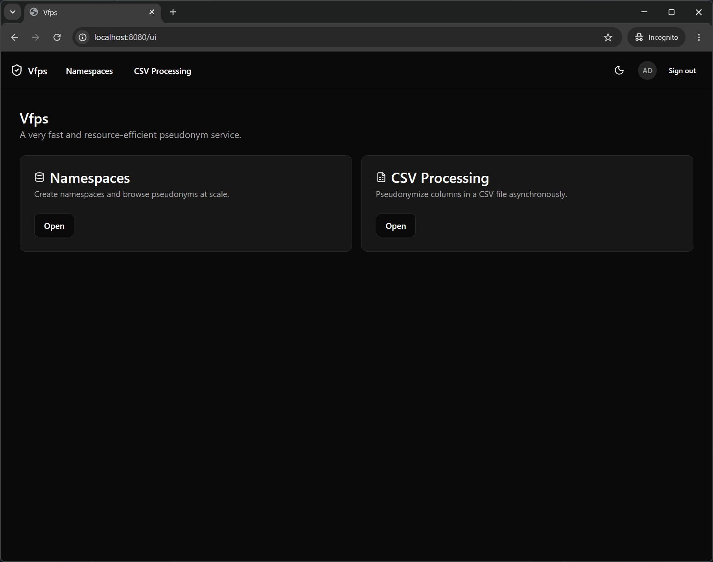

# vfps

<p align="center"></p>

[](https://scorecard.dev/viewer/?uri=github.com/miracum/vfps)
[](https://slsa.dev)

A [very fast](https://miracum.github.io/vfps/benchmarks/#e2e-load-testing) and [resource-efficient](https://miracum.github.io/vfps/benchmarks/#resource-efficiency) pseudonym service.

Supports horizontal service replication for highly-available deployments.

**Documentation: <https://miracum.github.io/vfps/>**

## Run it

> **Warning**
> Using the provided docker-compose.yaml is not a production-ready deployment but merely
> used to get started and testing quickly.
> It sets very restrictive resource limits uses the default password for an included,
> unoptimized PostgreSQL deployment.

```sh
docker compose -f compose.yaml --profile=test up
```

Visit <http://localhost:8080/swagger> to view the OpenAPI specification of the Vfps API:

You can use the JSON-transcoded REST API described via OpenAPI or interact with the service using gRPC.
For example, using [grpcurl](https://github.com/fullstorydev/grpcurl) to create a new namespace:

```sh
grpcurl \
  -plaintext \
  -import-path src/Vfps/ \
  -proto src/Vfps/Protos/vfps/api/v1/namespaces.proto \
  -d '{"name": "test", "pseudonymGenerationMethod": "PSEUDONYM_GENERATION_METHOD_SECURE_RANDOM_BASE64URL_ENCODED", "pseudonymLength": 32}' \
  127.0.0.1:8081 \
  vfps.api.v1.NamespaceService/Create
```

And to create a new pseudonym inside this namespace:

```sh
grpcurl \
  -plaintext \
  -import-path src/Vfps/ \
  -proto src/Vfps/Protos/vfps/api/v1/pseudonyms.proto \
  -d '{"namespace": "test", "originalValue": "to be pseudonymized"}' \
  127.0.0.1:8081 \
  vfps.api.v1.PseudonymService/Create
```

## Features

- [Namespaces](https://miracum.github.io/vfps/namespaces/) with a choice of pseudonym formats, multi-level (parent/child)
  namespaces, and multiple pseudonyms per original value
- Deterministic, oblivious [VOPRF pseudonyms](https://miracum.github.io/vfps/voprf/) (RFC 9497) from a separate key holder
- gRPC, JSON-transcoded REST, and [FHIR operations](https://miracum.github.io/vfps/fhir/)
- An [admin UI](https://miracum.github.io/vfps/admin-ui/) with [CSV pseudonymization jobs](https://miracum.github.io/vfps/csv-jobs/)
- OIDC sign-in, [namespace-scoped access control](https://miracum.github.io/vfps/access-control/), and vfps-issued access
  tokens
- A Helm chart for [production deployments](https://miracum.github.io/vfps/deployment/production/), with
  [TLS to PostgreSQL](https://miracum.github.io/vfps/deployment/postgresql-tls/) and an
  [encrypted Data Protection key ring](https://miracum.github.io/vfps/deployment/data-protection/)
- [OpenTelemetry metrics and traces](https://miracum.github.io/vfps/observability/)
- Signed container images with SLSA Level 3 provenance - see [Security](https://miracum.github.io/vfps/security/)

All settings are listed in the [configuration reference](https://miracum.github.io/vfps/configuration/).



## Development

### Prerequisites

- .NET 10.0: <https://dotnet.microsoft.com/en-us/download/dotnet>
- Docker CLI 20.10.17: <https://www.docker.com/>
- Docker Compose: <https://docs.docker.com/compose/install/>

### Build & run

Start an empty PostgreSQL database, Keycloak, and SeaweedFS for development (optionally add `-d` to run in the background):

```sh
docker compose -f compose.yaml --profile=keycloak --profile=s3 up
```

To additionally start an instance of [Jaeger Tracing](https://www.jaegertracing.io/), you can specify the `jaeger`
profile:

```sh
docker compose -f compose.yaml --profile=jaeger up
```

Then set `Tracing__IsEnabled=true` and `Tracing__Otlp__Endpoint=http://localhost:4317` (already the default in
`appsettings.Development.json`) and view traces at <http://localhost:16686>.

Restore dependencies and run in Debug mode:

```sh
dotnet restore
dotnet run -c Debug --project=src/Vfps
```

Open <https://localhost:8080/ui> to see the admin UI, and
<https://localhost:8080/swagger> to see the OpenAPI UI for the JSON-transcoded
gRPC services. You can use [grpcurl](https://github.com/fullstorydev/grpcurl)
to interact with the API:

> **Note**
> In development mode gRPC reflection is enabled and used by grpcurl by default.

```sh
grpcurl -plaintext \
    -d '{"name": "test", "pseudonymGenerationMethod": "PSEUDONYM_GENERATION_METHOD_SECURE_RANDOM_BASE64URL_ENCODED", "pseudonymLength": 32}' \
    127.0.0.1:8081 \
    vfps.api.v1.NamespaceService/Create

grpcurl -plaintext \
    -d '{"namespace": "test", "originalValue": "a test value"}' \
    127.0.0.1:8081 \
    vfps.api.v1.PseudonymService/Create
```

#### Run unit tests

```sh
dotnet test src/Vfps.Tests \
  --configuration=Release \
  --results-directory=./coverage \
  -- --coverage \
  --coverage-output-format cobertura \
  --coverage-output coverage.cobertura.xml \
  --coverage-settings src/Vfps.Tests/codecoverage.config
```

#### Generate Code coverage report

If not installed, install the report generation too:

```sh
dotnet tool install -g dotnet-reportgenerator-globaltool
```

```sh
reportgenerator -reports:"./coverage/coverage.cobertura.xml" -targetdir:"coveragereport" -reporttypes:Html
```

### Build container image

```sh
docker build -t ghcr.io/miracum/vfps:latest .
```
