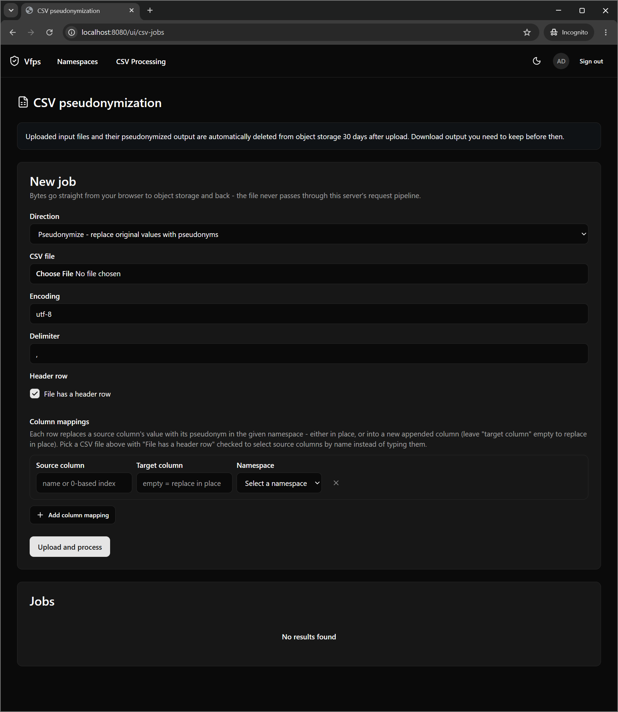

# CSV jobs

Upload a CSV file to pseudonymize or de-pseudonymize one or more columns as a background job. Files are streamed directly to and from S3-compatible object storage.

CSV job input/output bytes never pass through the vfps process itself: the admin UI uploads directly to a presigned S3 PUT URL and downloads directly from a presigned S3 GET URL, and the Hangfire background job (running in-process, no separate worker deployment) streams the file S3-to-S3. See `compose.yaml`'s `s3` profile for a local SeaweedFS setup usable for manual testing.

Each job runs in one of two directions: **Pseudonymize** (replace original values with their pseudonym - requires write access to every namespace used) or **De-pseudonymize** (replace pseudonym values with their original value - requires reverse-lookup access, since this reveals data). A pseudonym with no match in its namespace during de-pseudonymization is left unchanged in the output rather than failing the job.

## Unknown values

A **pseudonymize** job normally creates a pseudonym for any value the namespace doesn't know yet.
Where that is wrong - a file that is supposed to contain only subjects already in a cohort, where a
new pseudonym would silently record one that was never meant to be there - the **unknown values**
setting changes what happens instead:

- **Fail the job** stops at the first value the namespace doesn't know, before writing any part of
  the chunk it was found in, and reports the data row, column and namespace it stopped at. The
  value itself is never recorded in the error, only where it was.
- **Leave the cell empty** writes an empty cell for each unknown value, counts them, and carries
  on. The count is shown on the job, separately from the "missing value" count: both render as an
  empty cell in the output and mean opposite things - "the input had nothing here" versus "the
  input had a value this namespace has never seen".

Neither ever writes the original value through to the output. That is what de-pseudonymization does
with a pseudonym it cannot resolve, where the field harmlessly stays a pseudonym; doing the same
here would leave unpseudonymized data in the very column the job was asked to replace.

The setting applies to pseudonymize jobs only, and is rejected rather than ignored on any other
direction - the other three either read pseudonyms or store pairs the caller already holds, so
there is nothing for it to guard. The equivalent single-value API operation is
`PseudonymService.Resolve`.

## Import and export

The same page also moves a whole namespace in and out as CSV, as two further job directions:

- **Import** loads already-known pairs instead of generating pseudonyms for them - for migrating a
  mapping table that predates vfps, or moving namespaces between instances. The file needs an
  `original` and a `pseudonym` column; when the file has a header row its columns are offered as
  dropdowns, and otherwise a column is named by its 0-based index. Any other column is ignored.
  Requires **write** access to the namespace.

  Optionally a third, **namespace column** can be chosen. Each row is then imported into the
  namespace named in that column, so a whole instance's export loads in one job rather than one per
  namespace; the single-namespace picker disappears, since there is no longer one to pick. Rows
  naming a namespace that doesn't exist - or leaving the column empty - are reported and skipped
  rather than failing the job or landing somewhere unintended. This needs **write access to every
  namespace** (an admin, or a grant made without a namespace): the namespaces a file names are only
  known once it is processed, long after the caller who submitted it is gone, so there is no
  narrower permission that can honestly be checked up front.

  Nothing is ever overwritten: an original value that already has a pseudonym keeps it, and a
  pseudonym already in use for a different original value is refused rather than left ambiguous to
  reverse-lookup. Every row - accepted or not - comes back in the job's downloadable report as the
  input row plus a `status` column (`Imported`, `AlreadyPresent`, `OriginalValueConflict`,
  `PseudonymValueConflict`, `InvalidOriginalValue`, `ParentValueMissing`, `UnknownNamespace`, or
  `MissingValue` for a blank/placeholder cell), so re-running the same file is a clean no-op and a
  partial import is inspectable row by row. A namespace that allows multiple pseudonyms per original value grows
  instead of conflicting, exactly as its generating create path does.

- **Export** writes every original value in a namespace and its pseudonym to a two-column CSV,
  ready to be imported elsewhere. It is the one direction with no file to upload - the job is
  queued as soon as it is created. Requires **reverse-lookup** access: the output is the
  namespace's original values, in bulk, so it is gated like de-pseudonymization rather than like a
  read.

## Configuration

CSV jobs are off by default. Enabling them, and the object storage they use, is described under
[CSV jobs and object storage](configuration.md#csv-jobs-and-object-storage) in the configuration
reference.
