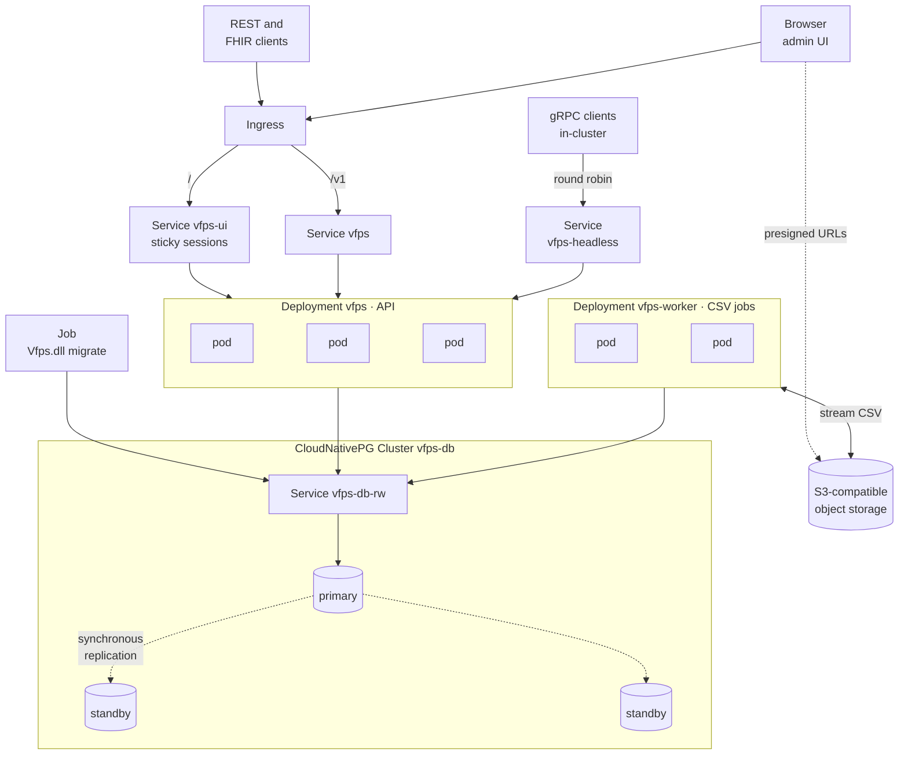

# Production deployment

See [charts/vfps](https://github.com/miracum/vfps/tree/master/charts/vfps) for a
production-grade deployment on Kubernetes via Helm:

```sh
helm install --create-namespace vfps oci://ghcr.io/miracum/vfps/charts/vfps -n vfps
```

The [VOPRF](../voprf.md) key holder has a chart of its own,
[charts/voprf-server](https://github.com/miracum/vfps/tree/master/charts/voprf-server).

## Architecture

A highly available deployment, with the admin UI, the API and CSV jobs separated, and the database
run by [CloudNativePG](https://cloudnative-pg.io/) instead of the chart's bundled single-instance
PostgreSQL:



| In the diagram                                                                               | Chart values                                                       |
| -------------------------------------------------------------------------------------------- | ------------------------------------------------------------------ |
| Three API replicas spread across zones, at most one down at a time                           | `replicaCount`, `topologySpreadConstraints`, `podDisruptionBudget` |
| `/` to a separate UI Service holding the session affinity, `/v1` to the main one             | `ingress.hosts[].paths[].serviceName`, `service.ui`                |
| gRPC clients balancing per request across all API pods                                       | the `-headless` Service, always created                            |
| CSV jobs in their own Deployment, with its own shutdown window and resource budget           | `worker.enabled`, `worker.replicaCount`                            |
| Schema migrations run once per release rather than by every replica                          | `migrationsJob.enabled`                                            |
| An external, replicated PostgreSQL reached through its read-write Service, over verified TLS | `postgres.enabled: false`, `database.host`, `database.tls`         |

The reasons behind each of these are explained below. Encrypting the database connection is
covered in [PostgreSQL TLS](postgresql-tls.md), and CSV jobs and object storage in
[CSV jobs](../csv-jobs.md). Configure the CloudNativePG cluster with synchronous replication
(`spec.postgresql.synchronous`), so that a failover can't lose a pseudonym vfps has already
returned to a caller.

## Running more than one replica

vfps keeps no durable state of its own outside PostgreSQL, so replicas are interchangeable and can
be scaled horizontally. A few things are the deployment's responsibility rather than the
application's, and are easy to miss:

- **The admin UI needs session affinity.** The UI is Blazor Server: each browser session is a
  SignalR circuit living in one replica's memory. Without sticky sessions the initial page request
  and the circuit's WebSocket can land on different replicas, and a circuit can't be resumed on a
  different replica than the one that created it - which shows up in the browser console as
  `Failed to start the connection` / `No Connection with that ID: Status code '404'`. Configure
  cookie affinity in your ingress controller or, failing that, `sessionAffinity: ClientIP` on the
  Service. Check which object the controller reads its annotations from: Traefik's
  `traefik.ingress.kubernetes.io/service.sticky.cookie*` annotations belong on the **Service** and
  are ignored on the Ingress, while ingress-nginx's `nginx.ingress.kubernetes.io/affinity*` go on
  the Ingress. The gRPC and REST APIs are stateless and need none of this - and because the UI and
  the REST API share port 8080, affinity applied to a Service carrying both will pin REST clients
  that keep a cookie jar too. The chart's `service.ui.enabled` creates a separate UI Service to
  hold the affinity, leaving API traffic evenly balanced. Auth cookies and antiforgery tokens _are_ portable across
  replicas - the Data Protection key ring is persisted to PostgreSQL whenever
  `ConnectionStrings__PostgreSQL` is set (see the [configuration reference](../configuration.md)) - so affinity is about the circuit,
  not about login.
- **gRPC clients pin to a single replica.** A gRPC client opens one long-lived HTTP/2 connection,
  and a plain ClusterIP Service load-balances connections, not requests - so one client's traffic
  stays on whichever replica it first connected to. For traffic to actually spread, point clients at
  the chart's headless Service with client-side load balancing (`dns:///` plus a `round_robin`
  policy), or terminate gRPC at a proxy that balances per request.
- **Size the connection pool for the replica count, not the replica.** Npgsql's pool is per process
  and defaults to 100 connections, so N replicas can demand N x 100 against a PostgreSQL whose own
  `max_connections` commonly defaults to 100. Set `Maximum Pool Size` explicitly in the connection
  string, budget for `CsvProcessing__WorkerCount` on top of request traffic, and put PgBouncer in
  front if the arithmetic doesn't fit.
- **Caches are per-replica.** `Pseudonymization__Caching__*` is an in-process `MemoryCache`, so a
  namespace deleted via one replica can still be served from another replica's cache until the
  entry expires (`Pseudonymization__Caching__AbsoluteExpiration`, one hour by default). Namespaces
  are immutable once created, so this only affects deletion; shorten the expiration if that window
  matters to you.
- **Give the pod time to drain.** On `SIGTERM` the process stops accepting new work and finishes
  what's in flight, bounded by `ShutdownTimeout`. Kubernetes removes the pod from Service endpoints
  asynchronously, so without a `preStop` delay some requests are still routed to a pod that has
  already begun shutting down. Add a `preStop` sleep of a few seconds and keep
  `terminationGracePeriodSeconds` > `ShutdownTimeout` > `CsvProcessing__JobServerShutdownTimeout`.
  Note the runtime image is chiseled and has no shell, so a `preStop` `exec` handler won't work -
  use the native `sleep` handler (Kubernetes 1.30+).
- **Run migrations once, not per replica.** Leave `ForceRunDatabaseMigrations` off and run the
  `Vfps.dll migrate` subcommand as a separate Job. Because that Job runs while
  the previous version's pods are still serving, migrations have to be backwards-compatible with the
  running version (expand/contract) for the upgrade to be non-disruptive.
- **CSV jobs can run in dedicated worker pods.** By default every replica processes jobs, which is
  fine until job load starts competing with API latency, or until you want jobs to drain slowly on
  shutdown while API pods roll quickly - a single deployment can only have one shutdown window and
  one resource budget. Setting `CsvProcessing__ProcessJobs=false` on the API pods and running a
  second deployment of the same image with it set to `true` separates the two. The Helm chart wires
  this up via `worker.enabled`.
- **The per-namespace pseudonym count metric is computed by one replica and shared.**
  `vfps_pseudonyms` comes from a `GROUP BY` count over the whole pseudonyms table, so it's
  recomputed every 5 minutes by a Hangfire recurring job - dispatched to a single server per tick,
  which is what keeps one replica paying for it - and written to the `pseudonym_counts` table, one
  row per namespace. Every replica reads that table on a short timer and exports the stored result,
  so all of them report the same figure: graph it with `max()` or `avg()` across replicas rather
  than `sum()`. A failed recompute is visible on the `/hangfire` dashboard and leaves the previous
  counts in place until the next tick succeeds.
