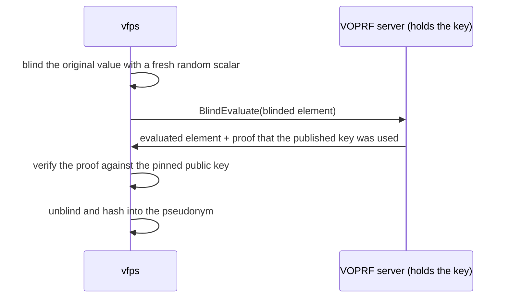

# VOPRF pseudonyms

A namespace created with `PSEUDONYM_GENERATION_METHOD_VOPRF` derives each pseudonym from the
original value with the verifiable oblivious pseudorandom function of
[RFC 9497](https://www.rfc-editor.org/rfc/rfc9497.html), VOPRF(ristretto255, SHA-512). The key
lives in a separate service, the **VOPRF server**, and the computation is split so that:

- the **server** holds the key and never learns the original value;
- **vfps** holds the original value and never learns the key;
- vfps **verifies** with every answer that the server used the key it published, rather than a
  different one chosen to single its records out.

What goes over the wire is a uniformly random group element: the server cannot recover the
value, and cannot tell that two requests carried the same one.

## When to use it

Unlike every other generation method, VOPRF is **deterministic**: the same original value under
the same key always yields the same pseudonym. That is what lets two deployments that use the
same VOPRF server agree on pseudonyms without ever exchanging the values behind them. Different
keys give unrelated pseudonyms, so datasets keyed separately can't be matched against each other.

It follows that a VOPRF namespace can't allow multiple pseudonyms per original value - there is
only one to be had - and that its pseudonym length is set by the client configuration below,
not per namespace.

## Setting it up

### Deploy the key holder

Deploy the VOPRF server with the
[voprf-server Helm chart](https://github.com/miracum/vfps/tree/master/charts/voprf-server),
which is hardened by default: TLS, authenticated callers, a per-caller rate limit and a
default-deny NetworkPolicy.

**Then pin its public key.** The server logs it at startup. vfps verifies every answer against
this pinned key, so take it out of band rather than from the server you are about to trust.

### Point vfps at it

| Variable                         | Default     | Description                                                                                                                              |
| -------------------------------- | ----------- | ---------------------------------------------------------------------------------------------------------------------------------------- |
| `Voprf__Address`                 | `""`        | Address of the VOPRF server. Leaving it empty disables the method, and creating a VOPRF namespace then fails with `FAILED_PRECONDITION`. |
| `Voprf__PublicKey`               | `""`        | The server's pinned public key, base64 or hex encoded. Required.                                                                         |
| `Voprf__ExpectedKeyId`           | `""`        | The key id the server must answer with. Optional, but turns a misdirected address into a clear error instead of a failed proof.          |
| `Voprf__AllowUnpinnedPublicKey`  | `false`     | Trust whatever key the server offers. For development only; logs a warning on every fetch.                                               |
| `Voprf__MaxBatchSize`            | `128`       | The most values sent to the server in one request.                                                                                       |
| `Voprf__IncludeKeyIdInPseudonym` | `true`      | Prefix each pseudonym with `<keyId>.`, which is what makes a key rotation migratable.                                                    |
| `Voprf__Format`                  | `Base64Url` | Unpadded base64url, or lowercase hex.                                                                                                    |
| `Voprf__Length`                  | `64`        | Bytes of output kept, 16-64.                                                                                                             |
| `Voprf__Normalization`           | `FormC`     | Unicode normalization applied before the value is encoded as UTF-8.                                                                      |

Every setting from `IncludeKeyIdInPseudonym` down changes the pseudonyms produced, so treat them
as a contract between all systems sharing the key, not as local preferences.

### Create a namespace

Create a namespace with `"pseudonymGenerationMethod": "PSEUDONYM_GENERATION_METHOD_VOPRF"`.

## Reaching the server is the security boundary

Evaluation reveals nothing about any input. What the server does is answer _with the key_:
anyone who can call it can pseudonymize anything they can guess, and where the input space is
enumerable - national IDs, dates of birth - that is the whole of the confidentiality the
pseudonyms have. Restrict who can reach it accordingly.

## Rotating the key

A VOPRF key can't be rotated like a certificate: a pseudonym is a function of the key, so a new
key changes every pseudonym, and stored ones can't be re-keyed without their original values.
Rotation is a data migration with two key generations serving side by side. Because each
pseudonym carries the id of the key that produced it, as in `v1.7fZ2ZSHDXCFmMPoZnQxLbkpg...`,
the rows still belonging to the old generation stay identifiable.

## Further reading

- [The voprf-server chart](https://github.com/miracum/vfps/tree/master/charts/voprf-server):
  installation, mutual TLS with cert-manager, hardening and rotation.
- [`Vfps.Voprf.Server`](https://github.com/miracum/vfps/blob/master/src/Vfps.Voprf.Server/README.md):
  the server's own configuration.
- [`Vfps.Voprf.Client`](https://github.com/miracum/vfps/blob/master/src/Vfps.Voprf.Client/README.md):
  normalization, output settings and failure modes.
- [`Vfps.Voprf`](https://github.com/miracum/vfps/blob/master/src/Vfps.Voprf/README.md):
  the protocol itself.
